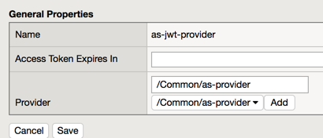
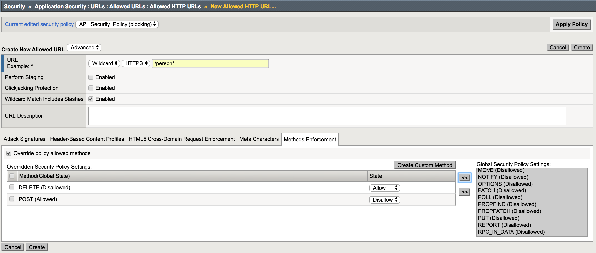

Last Update: November 4, 2017

Environment
===========

Deploy UDF blueprint “ISCFY18 – API Protection Lab”. You must complete
Postman queries from the client jumphost but you can complete Big-IP
configuration from the client jumphost or your laptop’s browser by
launching TMUI from UDF (Access -> TMUI) (recommended).

Credentials and Services
~~~~~~~~~~~~~~~~~~~~~~~~

Client Jumphost RDP:

user/user

Big-IP:

https://10.1.1.4

admin/admin

root/default

API:

https://api.vlab.f5demo.com @ 10.1.10.101

Preconfigured with VS and pool for API access, security added in lab
modules

Authorization Server:

https://as.vlab.f5demo.com @ 10.1.10.100

employeeuser/password

hruser/password

JSON Web Key (JWK) shared secret: “secret”

Module 1: Using Postman to make API requests
============================================

In this module you will learn how to make API requests with the Postman
client to simulate calls that might be made as part of an application,
for instance, a mobile app, native client app, client side webapp, or
server to server API request.

Task 1: Connect to Client Jumphost and launch Postman
-----------------------------------------------------

1. RDP to the client jumphost

2. Launch the Postman application. The icon looks like this:

    |image0|

Task 2: Learn how to use the preconfigured API request collection
-----------------------------------------------------------------

In this task you will learn how to use the preconfigured set of requests
in the HR API collection.

1. Click Collections

2. Click HR API

3. Click List Departments

4. Click Send

5. Notice the returned list of departments

|image1|

Task 3: Learn how to change environment variables
-------------------------------------------------

In this task you will learn how to change the environment variables that
are configured to alter which department you are querying data for. In
this case the variables are used in the URI, but there are other
variables used in some queries in the body as well.

Determine Police Department Salary Total
~~~~~~~~~~~~~~~~~~~~~~~~~~~~~~~~~~~~~~~~

1. Click on the Return Department Salary Total request in the collection

2. Click Send

3. Notice the total returned is 1106915639.7999947

Change environment variable for department
~~~~~~~~~~~~~~~~~~~~~~~~~~~~~~~~~~~~~~~~~~

1. Notice the GET request URI has a variable in it named {{department}}

   |image2|

2. Notice in the top right we have an environment set named “API
   Protection Lab”.

3. Click the gear in the top right, then click “manage environments”.

   |image3|

4. Click API Protection Lab

   |image4|

5. Change the value for department from “police” to “fire” then click
   update

   |image5|

6. Click the X in the top right to close the manage environments window

   |image6|

Determine Fire Department Salary Total
~~~~~~~~~~~~~~~~~~~~~~~~~~~~~~~~~~~~~~

1. Click Send

2. Notice the total returned is now 457971613.68

Task 4: Return the Environment variables to default
---------------------------------------------------

1. Change the department variable back to “police”

Module 2: Implement Coarse-Grain Authorization
==============================================

In this module you will implement authorization requirements. You will
require a valid JWT (JSON Web Token) before a client can access the API.
You will then gather a valid JWT and leverage it to make an API request.

Reminder: For best admin experience, access the TMUI from UDF (Big-IP ->
Access -> TMUI), not from inside the jumphost.

You can complete this lab using prebuilt objects to save time or create
your own. If you are completing it using prebuilt, skip ahead to “Task
7: Add the policies to the virtual server” and add “prebuilt-“ before
every object name.

Task 1: Create a JWK (JSON Web Key)
-----------------------------------

In this task you will create a JWK to use for validating the JWT sent.
In this lab you will use Octet and a shared secret, but options include
solutions like public/private key pair as well.

1. Go to Access -> Federation -> JSON Web Token -> Key Configuration ->
   Click **Create**

+---------------------+-----------+
| Field               | Value     |
+=====================+===========+
| Name                | api-jwk   |
+---------------------+-----------+
| ID                  | lab       |
+---------------------+-----------+
| Type                | Octet     |
+---------------------+-----------+
| Signing Algorithm   | HS256     |
+---------------------+-----------+
| Shared Secret       | secret    |
+---------------------+-----------+

|image7|

1. Click **Save**

Task 2: Create an OAuth provider
--------------------------------

In this task you will create an OAuth provider so that you can validate
a JWT created by it.

1. Go to Access -> Federation -> OAuth Client/Resource Server ->
   Provider -> Click **Create**

+--------------+----------------------------------------------------------------------------+
| Field        | Value                                                                      |
+==============+============================================================================+
| Name         | as-provider                                                                |
+--------------+----------------------------------------------------------------------------+
| Type         | F5                                                                         |
+--------------+----------------------------------------------------------------------------+
| OpenID URI   | https://as.vlab.f5demo.com/f5-oauth2/v1/.well-known/openid-configuration   |
+--------------+----------------------------------------------------------------------------+

Note the DNS name is different above than the default, you must change
it.

1. Click **Discover**

2. The fields below should be filled out with values like
   https://\ **as.vlab.f5demo.com**/<more uri here>

   |image8|

Note that you can manually configure these values, but the OIDC discover
capability simplifies deployment.

1. Click **Save**

Task 3: Setup the Token Configuration
-------------------------------------

In this task you will adjust some of the values retrieved automatically
via OIDC discover tool. This is necessary because the OIDC AS cannot
provide you with the values specific to your audience.

1. Go to Access -> Federation -> JSON Web Token -> Token Configuration
   -> Click on **auto\_jwt\_as-provider**

2. Type https://api.vlab.f5demo.com into audience and click Add

   |image9|

3. Under Additional Key add the api-jwk you just created as allowed

   |image10|

The object prebuilt-as-jwk was precreated for the authorization server
function. It matches api-jwk (and prebuilt-api-jwk) exactly because a
shared key is needed on both the authorization server and resource side.
In this case you could have reused it instead of making a new one, but
in production your authorization server may not be the Big-IP you are
protecting the API server on, and you would need to create it as shown
here.

1. Click Save

Task 4: Create a JWT Provider
-----------------------------

In this task you will create a JWT provider that can be selected in a
per request or per session policy for JWT validation.

1. Go to Access -> Federation -> JSON Web Token -> Provider List ->
   Click **Create**

2. Name: **as-jwt-provider**

3. Provider: Select **/Common/as-provider** and click **Add**

   |image11|

4. Click **Save**

Task 5: Create a per session policy
-----------------------------------

In this task you will create a new per session policy to validate the
JWT token and collect the claims data from parameters inside the JWT.

1. Go to Access -> Profiles/Policies -> Access Profiles (Per-Session
   Policies) -> Click **Create**

2. 

+-----------------+-------------------------+
| Field           | Value                   |
+=================+=========================+
| Name            | api-psp                 |
+-----------------+-------------------------+
| Profile Type    | OAuth-Resource Server   |
+-----------------+-------------------------+
| Profile Scope   | Profile                 |
+-----------------+-------------------------+
| Languages       | English                 |
+-----------------+-------------------------+

Also note that the User Identification Method is set to OAuth Token

|image12|

|image13|

|image14|

1. Click **Finished**

2. Click **Edit** on the line with the new api-psp policy you just
   created, a new tab will open

   |image15|

3. Click the **+** between Start and Deny

4. Select **OAuth Scope** from the **Authentication** tab and click
   **Add Item**

+-------------------------+---------------------------+
| Field                   | Value                     |
+=========================+===========================+
| Token Validation Mode   | Internal                  |
+-------------------------+---------------------------+
| JWT Provider List       | /Common/as-jwt-provider   |
+-------------------------+---------------------------+

Note that we are selecting Internal here. This is because we want to
validate the JWT by signature rather than making an external call.

1. Click **Save**

2. On the **successful** branch click the **Deny** ending and change it
   to **Allow,** then **Save.**

3. **Apply** the policy, the final should look like this:

   |image16|

4. Close the new tab

Task 6: Create a per request policy
-----------------------------------

In this task you will create a per request policy to validate
authorization on each request by checking for the presence and validity
of a JWT.

1. Go to Access -> Profiles/Policies -> Per-Request Policies -> Click
   **Create**

2. Name: api-prp

3. Click **Finished**

4. Click **Edit** on the policy, another tab will appear

5. Your policy should look like this:

   |image17|

It is not necessary to “Apply Policy” after work on a per request policy
because it instantly applies to the next request, unlike a per session
policy, which will only apply to new requests after applying.

1. Close the new tab

Task 7: Add the policies to the virtual server
----------------------------------------------

In this task you will add the policies you created to the virtual
server.

1. Click Local Traffic -> **Virtual Servers**

2. Click **api.vlab.f5demo.com**

3. Change Access Profile from none to **api-psp** (NOT as-psp)

4. Change Per Request Policy from none to **api-prp**

   |image18|

5. Click Update

Task 8: Test access to the API
------------------------------

In this task you will test your access to the API and find it is blocked
because you do not present a valid JWT.

1. Open Postman on the jumphost client

2. Select List Departments from the HR API collection and send the
   request

3. Review the response, note the 401 unauthorized and the header
   indicating you did not present a valid token

   |image19|

Task 9: Get a JWT from the Authorization Server
-----------------------------------------------

1. Click the **type** drop down under the **authorization** tab.

2. Select **OAuth 2.0**

3. Click **Get New Access Token**

   |image20|

Postman provides a mechanism to handle the OAuth client workflow
automatically. This means it will handle getting the authorization code
and then exchange it for an access token, which you will use. Without
this you would make two separate requests, one to get an authorization
code and another to exchange that for an access token.

1. Fields should be prefilled, but verify they match the below:

+------------------------+-----------------------------------------------------+
| Field                  | Value                                               |
+========================+=====================================================+
| Token name             | employeeuser                                        |
+------------------------+-----------------------------------------------------+
| Grant Type             | Authorization Code                                  |
+------------------------+-----------------------------------------------------+
| Callback URL           | https://www.getpostman.com/oauth2/callback          |
+------------------------+-----------------------------------------------------+
| Auth URL               | https://as.vlab.f5demo.com/f5-oauth2/v1/authorize   |
+------------------------+-----------------------------------------------------+
| Access Token URL       | https://as.vlab.f5demo.com/f5-oauth2/v1/token       |
+------------------------+-----------------------------------------------------+
| Client ID              | 9f1d39a8255e066b89a51f56b27506d39442c4f608c2f859    |
+------------------------+-----------------------------------------------------+
| Client Authenticatin   | Send as Basic Auth header                           |
+------------------------+-----------------------------------------------------+

Most of this data is provided by the authorization server. The callback
URL specified here is a special callback URL that the Postman client
intercepts and handles rather than calling out to the getpostman.com
website.

|image21|

1. Click **Request Token**

2. Select **employeeuser** in the authentication window that pops up and
   click **Logon**

3. Click the **X** to close this window

4. Make sure **employeeuser** is selected under Available Tokens drop
   down

5. Select **Request Headers** from the Add Authorization Data To drop
   down

6. Click **Preview Request**, the result should be this:

   |image22|

7. Go to the **Headers** tab and review the inserted **Bearer** token
   header:

   |image23|

Task 10: Send the request with JWT and review response
------------------------------------------------------

1. Click **Send** and review the response.

2. Note that now it is a 200 OK instead of 401 Unauthorized and that you
   have response data in the body.

   |image24|

You have now implemented coarse grained authorization and are requiring
clients to request a JWT from a trusted authorization server before
allowing access to the API.

Module 3: Adding Fine-Grain Authorization
=========================================

In this module you will add fine-grain controls to your policy to
restrict access to parts of the API based on parameters in the JWT. The
example will relate to user group membership, but it could be many
parameters (e.g. company, user, group, as source, etc).

The goal is to restrict access to any /person API requests to only
members of the HR department.

You must complete module 2 before proceeding to Module 3.

You can complete this lab using prebuilt objects to save time or create
your own. If you are completing it using prebuilt that you added in
module 2 to the virtual server, skip ahead to “Task 4: Validate your
policy blocks access to /person requests without HR group membership”.

Task 1: Add URL Branching to the Per Request Policy
---------------------------------------------------

In this task you will add URL branching and a groups check to the per
request policy

1.  Go to Access -> Profiles / Policies -> Per Request Policies

2.  Click **Edit** on api-prp

3.  Clik the **+** between Start and Allow

4.  Select **URL Branching** from the **General Purpose** tab and click
    **Add Item**

5.  Click the **Branch Rules** tab

6.  Change the name of the branch rule from Allow to **person**

7.  Click **change** on the rule

8.  Change URL Contains from domain.com to **/person**

9.  Click **Finished**

10. Result should look like this:

    |image25|

11. Click **Save**

12. On the fallback branch change Reject to **Allow**. The result should
    look like this:

    |image26|

Task 2: Add Groups Check to the Per Request Policy
--------------------------------------------------

In this task you will add a group check to the URL branch created in the
last step

1.  Click **+** on the person branch **between URL Branching and Allow**

2.  Select **Empty** from the **General Purpose** tab and click **Add
    Item**

3.  Change Name to “\ **Group Check**\ ”

4.  Click **Branch Rules** tab

5.  Click **Add Branch Rule**

6.  Change name to **HR**

7.  Click **change** on the expression

8.  Click **Advanced** tab

9.  Enter the following in the advanced box:

    **expr { [mcget {session.oauth.scope.last.jwt.groups}] contains "hr"
    }**

10. Click **Finished**, the result should look like this:

    |image27|

11. Click **Save**

12. On the branches after Group Check **change the endings** as follows:

    **HR -> Allow**

    **Fallback -> Reject**

    The result should be:

    |image28|

Task 3: Validate your policy still works for /department requests
-----------------------------------------------------------------

In this task you will verify you can still access the list of
departments

1. Go back to the **Postman** application in the client jumphost

2. **Send** the **List Departments** request and note you still get a
   **200 OK** response with data in the body.

If you cannot access the data you have made a mistake and must correct
it before continuing. This request should be unaffected by your changes.

Task 4: Validate your policy blocks access to person requests without HR group membership
------------------------------------------------------------------------------------------

In this task you will test the settings you just put in the per request
policy. You are expecting to be denied access to the /person URL because
employeeuser is not in the HR group that you have marked as a required
value in the JWT.

1. On the left side, select **List Employee Record**. It will now appear
   in another tab in the middle section and you should select it if it
   is not already.

2. Under Authorization type select **OAuth 2.0** for the type

3. From the **Available Tokens** drop down, select **employeeuser**

4. Make sure Add Authorization Data is set to **Request Headers**

5. Click **Preview Request** and note the header has been inserted

   |image29|

6. Click **Send**

7. The result should be a **401 unauthorized** with no data in the body.
   The header will report an invalid token.

   |image30|

You were denied access because the JWT retrieved by this user is not
allowed to access that data. We can resolve this by using credentials
that will generate a JWT valid for this request.

Task 5: Acquire a JWT for hruser and validate it can access /person
-------------------------------------------------------------------

In this task you will get another JWT and use that to gain access to the
/person portion of the API.

1.  Click Get **New Access Token**

    |image31|

2.  Change the token name to **hruser**, the rest of the settings should
    be already correct.

    |image32|

3.  Click **Request Token**

4.  Select **hruser** at the logon page and press logon.

    |image33|

5.  A JWT should be returned and your JWT management token window will
    look like this:

    |image34|

6.  Notice you now have two tokens, and click the X to close the window

7.  Select hruser from the Available Tokens drop down

8.  Click Preview Request

    |image35|

9.  Click Send, you should get a 200 OK response and data in the
    response body like this:

    |image36|

10. You can now change the token used on any request by using this
    process:

    a. Select the request

    b. Select the Authorization tab

    c. Select OAuth 2.0 from the type drop down menu

    d. Select the correct token from the Available Tokens drop down menu

    e. Make sure Authorization Data is set to Request Headers

    f. Click Preview Request to add the token to the headers

    g. Click Send on the request

In this module we’ve used group membership to restrict access to
particular URIs, but in production you may encounter many different
variations. For example, an iRule can set an APM session variable equal
to the request method (e.g. GET, POST, etc) and then in the Per Request
Policy you can branch on method, only allowing POST from certain users,
groups, IPs, etc

JWTs are typically short lived and may or may not use refresh tokens. In
this lab the JWTs have been set as valid for several hours so you will
not need to get new JWTs during the lab.

Module 4: Protect API requests
==============================

In this module you will build an ASM policy to protect the API server.
You will test it in the next module.

To save time you may apply the “prebuilt-API\_Security\_Policy”,
“prebuilt-API\_Lab\_Logging”, and “prebuilt-API\_DoS” profiles to the
virtual server instead of building them in this module. You may then
skip to module 5 to see the protections it provides.

Task 1: Create a new Application Security Policy
------------------------------------------------

In this task, you will create a Rapid deployment new application
security policy.

1. Log into TMUI

2. Create new Application Security policy (Security -> Application
   Security -> Security Policies).

3. Use the Rapid Deployment policy settings below and name the policy
   “API\_Security\_Policy” (use advanced mode in the top right):

|image37|

Task 2: Create a new Logging profile
------------------------------------

In this task, you will create a logging profile to log all requests.

1. Create logging profile (Security -> Event Logs -> Logging Profiles).
   Use the logging profile settings below: |image38|

   |image39|

   |image40|

2. Click Finished

3. Apply the “API\_Lab\_Logging” Profile to the virtual
   “api.vlab.f5demo.com” virtual server.

    Navigate to Local Traffic => Virtual Servers => Virtual Server List.

    Select “api.vlab.f5demo.com.

    Click the Security tab and move in Log profile API\_Lab-Logging to
    selected.

    Click Update.

|image41|

Task 3: Create valid hostname
-----------------------------

In this task, you will create a valid hostname for requests secured by
this policy.

1. Create hostnames profile (Security -> Application Security -> Headers
   -> Hostnames).

2. Define the hostname per the image below:

   |image42|

3. Click Create.

Task 4: Create JSON Profile
---------------------------

In this task, you will create a JSON Profile.

1. Create JSON profile (Security -> Application Security -> Content
   Profiles -> JSON Profiles).

2. Define the JSON profile settings per the image below:

    |image43|

1. Click Create.

Task 5: Create Allowed URLs
---------------------------

In this task, you will limit security policy to allowed wildcard URLs,
and define appropriate methods allowed:

1. Delete the “\*” Wildcard URLs (Security -> Application Security ->
   URL -> Allowed URLs -> Allowed HTTP URLs).

2. Create new Allowed URLs (Security -> Application Security -> Allowed
   URLs -> Allowed HTTP URLs) per the images below (/person\* and
   /department\*), clicking create after each URL. Configure Methods
   Enforcement for the /person\* URI as below. Clear Perform Staging
   checkbox while creating those URLs:

   |image44|

   |image45|

3. For both URI created, configure JSON profile enforcement, using
   Header-Based Content Profiles. Remove the existing default profiles
   and create the new one as following:

   |image46|

Task 6: Create Parameters
-------------------------

In this task, you will create the allowed URLs, and define appropriate
methods allowed:

1. Create an Explicit Parameter for each of the Parameters listed, using
   the template image specified below, with the exceptions listed
   (Security -> Application Security -> Parameters -> Parameters List).
   Clear Perform Staging check box for each parameter.

   a. department

   b. first\_name

   c. last\_name

   d. middle\_initial: Limit Maximum length to 1.

   e. salary: select Integer data type, max length 10

   f. title

      |image47|

2. Click Create after each parameter created.

3. Delete the \_\_Viewstate parameter

4. Navigate to Security->Application Security->Parameters->Parameters
   List. Check all parameters added and click Enforce:

|image48|

Task 7: Create Attack Signature Set
-----------------------------------

In this task, you will create a custom Attack signature set to limit the
policy to relevant signatures for the protected API.

1. Navigate to new signature set (Security -> Options -> Application
   Security -> Attack Signatures -> Attack Signature Sets).

2. Create a new signature set using the template image below:

   Note: Once filter is applied, move all “Available signatures to
   “Applied Signatures”.

|image49|

1. Click Create.

2. Navigate to Security -> Application Security -> Policy -> Policy
   Properties and click on Attack Signatures Configuration:

|image50|

1. Expand Attack Signatures menu and click Change button on the right:

|image51|

1. Assign only the API\_Lab\_SigSet signatures set to the policy and
   click Change:

|image52|

1. Click Save to save policy changes.

Task 8: Modify Policy Blocking Settings
---------------------------------------

In this task, you will modify policy blocking settings to block most
types of attacks.

1. Navigate to learning and blocking settings (Security -> Application
   Security -> Policy Building -> Learning and Blocking).

2. Modify learning and blocking settings via the template images below
   (Advanced Mode):

   |image53|

3. Click Save.

   |image54|

   |image55|

   |image56|

   |image57|

   |image58|

   |image59|

   |image60|

   |image61|

4. Save and “Apply Policy”.

Task 9: Create API DoS Protection Profile
-----------------------------------------

In this task, you will create DoS protection profile for the API
interface that will protect against known bots and DoS attacks.

1. Navigate to Security -> DoS Protection -> DoS Profiles and click
   Create. Enter the name for the new DoS profile and click Finished.

   |image62|

2. Open the new DoS profile. Set threshold sensitivity to high. You can
   create your address list on the right then drag and drop it to the
   Default White list line to exclude specific IP address from been
   analyzed by the DoS profile. Click on the “+” sign next to the
   Address Lists, fill out the White List name and the desired IP
   address, click Add then Update. |image63|

|image64|

1. Click Update to safe the settings.

2. Open Application Security tab, check Application Security Enabled and
   click on Edit All:

|image65|

1. Clear Heavy URL Protection checkbox and click Update.

   |image66|

2. Go to Bot Signatures, check Enabled checkbox, choose Block for Benign
   Categories and click Update. These setting will block all known bots
   from accessing API URL.

   |image67|

3. Go to TPS-based Detection, choose Operation Mode Blocking, Thresholds
   Modes Manual, set Relative Threshold “reached at least” value to 2
   and Absolute Threshold TPS Reached to 3 tps. Check only Request
   Blocking for Source IP detection:

   |image68|

   Note: Customer may prefer using Automatic Thresholds Modes, while
   this lab limited to manual only for demo purposes.

4. In the By URL Detection Section uncheck Heavy URL protection, and
   configure only Request Blocking in both URL Detection and Site Wide
   sections:

   |image69|

5. Click Update.

Task 10: Apply API DoS Protection Profile
-----------------------------------------

In this task, you will apply the DoS protection profile for the API
interface that will protect against known bots and DoS attacks.

1. Apply DoS profile to the virtual server.

   Navigate to Local Traffic->Virtual Servers->Virtual Server List->
   api.vlab.f5demo.com and open Security->Policies tab.

   Enable DoS Protection Profile and choose API\_DoS profile.

   |image70|

2. Click Update.

Module 5: Demo JSON API Protection By ASM
=========================================

In this module, you will demonstrate how ASM can protect JSON API
against JSON parser attack, SQL Injection, Directory Traversal and DoS
attacks.

Task 1: DoS Attack
------------------

In this task, you will simulate DoS attack with Postman Runner and
observe how it’s been mitigated by Application DoS profile.

1. On the Windows client choose HR\_API\_DoS collection then DoS
   request.

2. Repeat Module 3 Task 5 for this request to get a new JWT access
   token.

3. Click Save to save the request with new access token.

4. Click Runner on the top of the window:

   |image71|

5. Choose HR\_API\_DoS collection and configure the run as following.
   Click Run HR\_API\_DoS. Assure right environment has been chosen, and
   For No Request Log has been configured:

   |image72|

6. After a short period of time Postman Runner may report failing
   transactions (it may not and gracefully handle the rate limiting,
   proceed to check logs in next step anyway):

   |image73|

7. On the BIG-IP navigate to Security->Event Logs-> DoS -> Application
   Events

   Look at the details of the attack detection and mitigation
   applied.\ |image74|

Task 2: Accessing Disallowed URL
--------------------------------

In this task, you will try accessing URL not allowed by ASM policy.

1. On the client machine Postman app chose Disallowed URL request.

2. Use previously retrieved access token by setting Authorization Type
   to Oath 2.0 and Available Tokens to hruser (similar to Module 3 Task
   5 without getting a new token).

3. Click Send. ASM should return a blocking page as below:

   |image75|

4. On the BIG-IP navigate to Security->Event Logs->Application
   ->Requests. Click on the last (top) request and look at the violation
   details:

   |image76|

Task 3: Illegal JSON parameter value - 1
----------------------------------------

In this task, you will simulate attack by running request with illegal
JSON parameter.

1. On the client machine Postman app chose JSON Parsing Array request.

2. Use previously retrieved access token by setting Authorization Type
   to Oauth 2.0 and Available Tokens to hruser (similar to Module 3 Task
   5 without getting a new token).

3. Click Send. ASM should return a blocking page as below:

   |image77|

4. On the BIG-IP navigate to Security->Event Logs->Application
   ->Requests. Click on the last (top) request and look at the violation
   details:

   |image78|

Task 4: Illegal JSON parameter value - 2 
-----------------------------------------

In this task, you will simulate another attack by running request with
illegal JSON parameter.

1. On the client machine Postman app chose Parameter Length&Signatures
   request.

2. Use previously retrieved access token by setting Authorization Type
   to Oath 2.0 and Available Tokens to hruser (similar to Module 3 Task
   5 without getting a new token).

3. Click Send. ASM should return a blocking page as below:

   |image79|

4. On the BIG-IP navigate to Security->Event Logs->Application
   ->Requests. Click on the last (top) request and look at the violation
   details:

   |image80|

Task 5: Non-JSON request 
-------------------------

In this task, you will simulate attack by running non JSON request.

1. On the client machine Postman app chose Non-JSON request.

2. Use previously retrieved access token by setting Authorization Type
   to Oath 2.0 and Available Tokens to hruser (similar to Module 3 Task
   5 without getting a new token).

3. Click Send. ASM should return a blocking page as below:

   |image81|

4. On the BIG-IP navigate to Security->Event Logs->Application
   ->Requests. Click on the last (top) request and look at the violation
   details:

   |image82|

Task 5: Shellshock request 
---------------------------

In this task, you will simulate Shellshock attack by running request
with specific header.

1. On the client machine Postman app chose Shellshock request.

2. Use previously retrieved access token by setting Authorization Type
   to Oath 2.0 and Available Tokens to hruser (similar to Module 3 Task
   5 without getting a new token).

3. Click Send. ASM should return a blocking page as below:

   |image83|

1. On the BIG-IP navigate to Security->Event Logs->Application
   ->Requests. Click on the last (top) request and look at the violation
   details:

   |image84|

Module 6: Enable AVR Reporting
==============================

Task 1: Create a new HTTP Analytics Profile
-------------------------------------------

In this task, you will create a HTTP Analytics profile.

1. Log into TMUI

2. Create a new HTTP Analytics Profile using the template image below
   (Local traffic -> Profiles -> HTTP Analytics):

   |image85|

3. Click “Finished”.

Task 2: Create a new TCP Analytics Profile
------------------------------------------

In this task, you will create a TCP Analytics profile.

1. Log into TMUI

2. Create a new TCP Analytics Profile using the template image below
   (Local traffic -> Profiles -> TCP Analytics):

   |image86|

   Click “Finished”.

.. |image0| image:: media/image1.tiff
   :width: 0.78126in
   :height: 0.78126in
.. |image1| image:: media/image2.png
   :width: 6.50000in
   :height: 4.35694in
.. |image2| image:: media/image3.png
   :width: 5.29992in
   :height: 0.99090in
.. |image3| image:: media/image4.png
   :width: 3.68999in
   :height: 2.50278in
.. |image4| image:: media/image5.png
   :width: 2.60173in
   :height: 1.50278in
.. |image5| image:: media/image6.png
   :width: 4.42492in
   :height: 2.95846in
.. |image6| image:: media/image7.png
   :width: 2.18282in
   :height: 1.88094in

.. |image18| image:: media/image19.png
   :width: 4.66667in
   :height: 2.33333in
.. |image19| image:: media/image20.png
   :width: 5.30941in
   :height: 3.19813in
.. |image20| image:: media/image21.png
   :width: 5.92492in
   :height: 1.92750in
.. |image21| image:: media/image22.png
   :width: 4.13685in
   :height: 3.75278in
.. |image22| image:: media/image23.png
   :width: 5.69048in
   :height: 2.32240in
.. |image23| image:: media/image24.png
   :width: 5.92492in
   :height: 1.99586in
.. |image24| image:: media/image25.png
   :width: 5.93125in
   :height: 3.34773in

.. |image29| image:: media/image30.png
   :width: 5.93125in
   :height: 2.49797in
.. |image30| image:: media/image31.png
   :width: 5.92492in
   :height: 1.05332in
.. |image31| image:: media/image32.png
   :width: 4.62500in
   :height: 1.38889in
.. |image32| image:: media/image33.png
   :width: 5.58451in
   :height: 5.25278in
.. |image33| image:: media/image34.png
   :width: 3.36111in
   :height: 2.88889in
.. |image34| image:: media/image35.png
   :width: 5.93125in
   :height: 2.39214in
.. |image35| image:: media/image36.png
   :width: 5.93125in
   :height: 3.05054in
.. |image36| image:: media/image37.png
   :width: 5.93125in
   :height: 2.30533in
.. |image37| image:: media/image38.png
   :width: 6.48819in
   :height: 2.55417in

.. |image46| image:: media/image47.tiff
   :width: 6.43125in
   :height: 2.67282in

.. |image53| image:: media/image54.png
   :width: 5.93125in
   :height: 2.89465in

.. |image55| image:: media/image56.png
   :width: 5.93125in
   :height: 4.47885in

.. |image62| image:: media/image63.png
   :width: 6.05625in
   :height: 1.22213in

.. |image71| image:: media/image72.png
   :width: 1.60565in
   :height: 3.00278in
.. |image72| image:: media/image73.png
   :width: 5.93125in
   :height: 3.72265in
.. |image73| image:: media/image74.png
   :width: 5.93125in
   :height: 3.72265in
.. |image74| image:: media/image75.png
   :width: 5.93125in
   :height: 1.11464in
.. |image75| image:: media/image76.png
   :width: 6.43125in
   :height: 2.46805in
.. |image76| image:: media/image77.png
   :width: 6.43125in
   :height: 3.13753in
.. |image77| image:: media/image78.png
   :width: 6.43125in
   :height: 3.26620in
.. |image78| image:: media/image79.png
   :width: 6.49514in
   :height: 2.99028in
.. |image79| image:: media/image80.png
   :width: 6.43125in
   :height: 3.20669in
.. |image80| image:: media/image81.png
   :width: 6.43125in
   :height: 3.12784in
.. |image81| image:: media/image82.png
   :width: 6.43125in
   :height: 3.01697in
.. |image82| image:: media/image83.png
   :width: 6.49375in
   :height: 2.95764in
.. |image83| image:: media/image84.png
   :width: 6.43125in
   :height: 2.87399in
.. |image84| image:: media/image85.png
   :width: 6.43125in
   :height: 3.15233in

